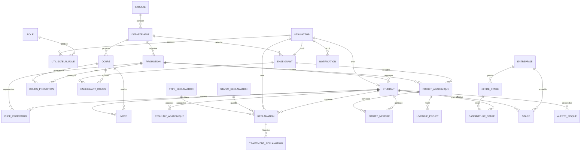

# Modélisation de la base de données - Smart Faculty

## Objectif

Cette base de données centralise les services académiques d'une faculté:

- authentification et rôles;
- gestion des étudiants, enseignants, promotions et cours;
- notes et résultats académiques;
- réclamations et suivi de traitement;
- projets académiques et livrables;
- stages, offres et candidatures;
- étudiants à risque;
- notifications.

La modélisation est pensée pour un futur backend en PHP POO avec une base MySQL ou MariaDB.

## Rôles fonctionnels

Les rôles applicatifs sont stockés dans la table `roles`:

- Administrateur;
- Étudiant;
- Enseignant;
- Chef de promotion;
- Doyen.

Un utilisateur peut avoir plusieurs rôles grâce à la table associative `utilisateur_roles`.
Cela permet, par exemple, qu'un étudiant soit aussi chef de promotion.

## MCD simplifié

## Cardinalités principales

| Relation | Cardinalité | Explication |
|---|---:|---|
| Faculté - Département | 1,N | Une faculté possède plusieurs départements. |
| Département - Promotion | 1,N | Une promotion appartient à un département. |
| Promotion - Étudiant | 1,N | Un étudiant est inscrit dans une promotion active. |
| Utilisateur - Rôle | N,N | Un utilisateur peut avoir plusieurs rôles. |
| Utilisateur - Étudiant | 1,0..1 | Un utilisateur peut avoir un profil étudiant. |
| Utilisateur - Enseignant | 1,0..1 | Un utilisateur peut avoir un profil enseignant. |
| Cours - Promotion | N,N | Un cours peut être suivi par plusieurs promotions. |
| Enseignant - Cours | N,N | Un enseignant peut donner plusieurs cours. |
| Étudiant - Note | 1,N | Un étudiant reçoit des notes dans plusieurs cours. |
| Étudiant - Réclamation | 1,N | Un étudiant peut créer plusieurs réclamations. |
| Réclamation - Traitement | 1,N | Une réclamation possède un historique de traitement. |
| Projet - Étudiant | N,N | Un projet peut avoir plusieurs membres. |
| Offre de stage - Candidature | 1,N | Une offre peut recevoir plusieurs candidatures. |
| Étudiant - Alerte risque | 1,N | Les alertes peuvent être recalculées par période. |

## MLD relationnel

### Administration et authentification

- `roles(id, code, libelle)`
- `utilisateurs(id, nom, prenom, email, mot_de_passe_hash, telephone, actif, created_at, updated_at)`
- `utilisateur_roles(utilisateur_id, role_id)`

### Structure académique

- `facultes(id, nom, sigle)`
- `departements(id, faculte_id, nom, sigle)`
- `annees_academiques(id, libelle, date_debut, date_fin, active)`
- `promotions(id, departement_id, annee_academique_id, code, libelle, niveau)`
- `etudiants(id, utilisateur_id, promotion_id, matricule, date_naissance, sexe, adresse, statut)`
- `enseignants(id, utilisateur_id, departement_id, matricule, grade, specialite)`
- `chefs_promotion(id, etudiant_id, promotion_id, annee_academique_id)`

### Cours, notes et résultats

- `cours(id, departement_id, code, intitule, credits, semestre, actif)`
- `cours_promotions(id, cours_id, promotion_id, annee_academique_id)`
- `enseignant_cours(id, enseignant_id, cours_id, promotion_id, annee_academique_id)`
- `notes(id, etudiant_id, cours_id, annee_academique_id, type_evaluation, note, coefficient, statut, publie_par_enseignant_id, date_publication)`
- `resultats_academiques(id, etudiant_id, annee_academique_id, moyenne, credits_valides, decision)`

### Réclamations

- `types_reclamation(id, code, libelle)`
- `statuts_reclamation(id, code, libelle)`
- `reclamations(id, reference, etudiant_id, cree_par_utilisateur_id, type_id, statut_id, titre, description, priorite, assignee_a_utilisateur_id, created_at, updated_at)`
- `traitements_reclamation(id, reclamation_id, statut_id, traite_par_utilisateur_id, commentaire, created_at)`

### Projets académiques

- `projets_academiques(id, promotion_id, encadreur_id, titre, description, statut, progression, date_debut, date_fin_prevue)`
- `projet_membres(id, projet_id, etudiant_id, role_membre)`
- `livrables_projet(id, projet_id, depose_par_etudiant_id, titre, type_fichier, chemin_fichier, statut, date_depot)`

### Stages

- `entreprises(id, nom, secteur, adresse, email_contact, telephone_contact)`
- `offres_stage(id, entreprise_id, titre, description, lieu, duree, statut, date_publication, date_limite)`
- `candidatures_stage(id, offre_id, etudiant_id, statut, message, date_candidature)`
- `stages(id, etudiant_id, entreprise_id, offre_id, encadreur_id, sujet, maitre_stage, statut, date_debut, date_fin)`

### Risques et notifications

- `alertes_risque(id, etudiant_id, annee_academique_id, moyenne, nombre_echecs, niveau, commentaire, detecte_le)`
- `notifications(id, utilisateur_id, titre, message, lu, created_at)`

## Règles de gestion

1. Un email utilisateur est unique.
2. Un matricule étudiant est unique.
3. Un matricule enseignant est unique.
4. Une note doit être comprise entre 0 et 20.
5. Un projet académique peut avoir plusieurs étudiants membres.
6. Une réclamation conserve son historique dans `traitements_reclamation`.
7. Les analytics ne nécessitent pas forcément une table dédiée: ils sont calculés à partir des notes, réclamations, stages, projets et alertes.
8. Les étudiants à risque peuvent être recalculés régulièrement et sauvegardés dans `alertes_risque`.
9. Le chef de promotion est un étudiant lié à une promotion pour une année académique donnée.
10. Le doyen est un utilisateur ayant le rôle `DOYEN`.

## Choix techniques

- Base cible: MySQL ou MariaDB.
- Encodage: `utf8mb4`.
- Moteur: `InnoDB`.
- Clés primaires: entiers auto-incrémentés.
- Relations: clés étrangères avec règles `RESTRICT`, `CASCADE` ou `SET NULL` selon le besoin métier.
- Backend futur: PHP POO avec classes Repository/DAO par module.
